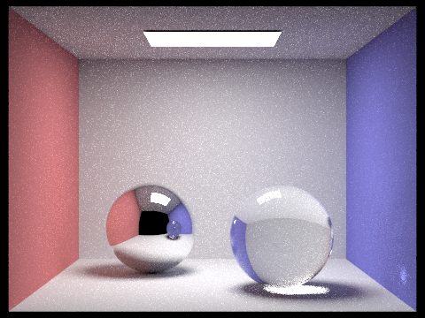

# CS 184 Final Project: Glass Half Full, Glass Half Empty
Christine Zhang, Clara Hung, Kerrine Tai, and Ramya Chitturi

Link to webpage: <a href="https://clara-not-claire.github.io/cs184-final-proj/">https://clara-not-claire.github.io/cs184-final-proj/</a>

## What we've accomplished so far
Our goal for the project milestone was to implement an MVP of our refracting model based off of Homework 3-2 from previous years. Additionally, we wanted to learn how to use blender as well as modify our existing dae files such that we can build more complex scenes.

We have finished the relevant parts of Project 3-2 needed to complete our project. This includes filling in the mirror, refraction, and glass BSDF code in advanced_bsdf.cpp. This means that we can now render the objects in the current .dae files as either of these materials or with a custom index of refraction that we set ourselves (due to Snell’s law). We also learned how to modify the existing .dae files, like CBbunny, to change the BSDF material of the object for rendering. For example, we changed the IOR of the bunny to be 1.33 so it seems like it’s made out of water.

    

        
        
 Water Bunny (IOR=1.33) 

    

    

        
        
 Water Bunny (IOR=1.33)

    

## Preliminary results

## How we adhered to our plan

## Updated work plan
