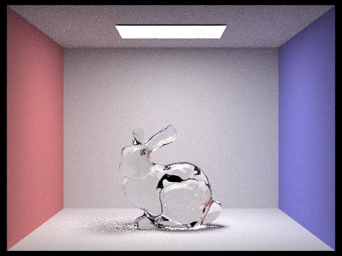
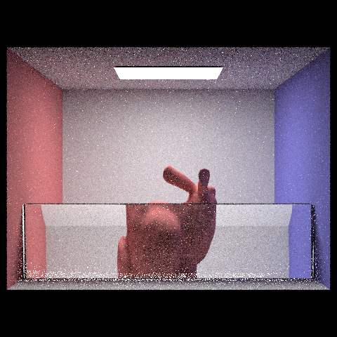
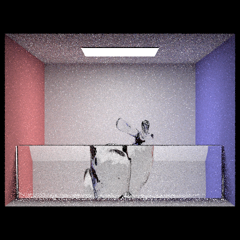

# CS 184 Final Project Milestone: Glass Half Full, Glass Half Empty
Team 35: Christine Zhang, Clara Hung, Kerrine Tai, and Ramya Chitturi

Link to project proposal and webpage: <a href="https://clara-not-claire.github.io/cs184-final-proj/">https://clara-not-claire.github.io/cs184-final-proj/</a>

Link to slides: <a href="https://docs.google.com/presentation/d/1hpctgJlwToDg6AwSjs3SnDHkXQO7yKAh0wzfBWaUqJQ/edit?usp=sharing">https://docs.google.com/presentation/d/1hpctgJlwToDg6AwSjs3SnDHkXQO7yKAh0wzfBWaUqJQ/edit?usp=sharing</a>

Link to video: <a href="https://youtu.be/xbOjatBws2M">https://youtu.be/xbOjatBws2M</a>

## What we've accomplished so far
Our goal for the project milestone was to implement a basic refracting model based off of Homework 3-2 from previous years. Additionally, we wanted to learn how to use Blender as well as modify our existing dae files such that we can build more complex scenes.

We have finished the relevant parts of Project 3-2 needed to complete our project. This includes filling in the mirror, refraction, and glass BSDF code in `advanced_bsdf.cpp`. This means that we can now render the objects in the current .dae files as either of these materials or with a custom index of refraction that we set ourselves (due to Snell's law). We also learned how to modify the existing .dae files, like CBbunny, to change the BSDF material of the object for rendering. For example, we changed the IOR of the bunny to be 1.33 so it seems like it's made out of water.

Using the feedback from our project proposal, we got started using Blender 2.74 so we could directly design and import our scene into the scene parser. However, we ran into many issues with using the older version of Blender. For example, since we don't have a Desktop setup, the controls and UI of the older Blender are very difficult to use with our laptops. Additionally, most of the complex BSDF functionalities we need to design complex scenes, such as the principled BSDF, were introduced in later versions of Blender. Furthermore, the Blender tutorials we are using to gain our foundational skills are made using later versions. To make our lives easier, we decided to switch to Blender 4.4 based on the instructions on this [Ed post](https://edstem.org/us/courses/73043/discussion/6365576?comment=14963595). 

We became familiar with the .dae files by learning how to transform objects within the scene. We combined the /sky/CBbunny.dae file with a cube we created in blender, and transformed the cube to make it seem like the bunny is behind a glass wall.

## Preliminary Results

    

        
        
 Glass spheres (IOR=1.45) 

    

    

        
        
 Water bunny (IOR=1.33)

    

    

        
        
 Red bunny behind glass wall 

    

    

        
        
 Glass bunny behind glass wall

    

## How we adhered to our plan
We were able to complete most of the tasks that we set out to do by the milestone in our proposal. First, we were able to implement Snell's Law and added the BSDF functionality in. Because of the BSDF functionality and modeling the water in Blender, we no longer need to assume that the surface is flat since we import this into the .dae file. We have not yet created the blue tint for the water that will help the water seem more realistic.

## Updated work plan
For the rest of the project, we want to work on the following points:
1. Adding multiple layers of liquids with different indices of refraction, like layers of air, oil, and water.
2. Creating shapes like cups and wine glasses in Blender and making light refract through those objects. We would also like to make a straw in a water glass to see how the straw refracts.
3. Adding a blue tint to the water for the bunny-in-water image
4. Adding the water to the images (e.g. a bunny submerged in water).
5. Modeling the water surface as some continuous function instead of a horizontal line (e.g. a quadratic or sine function) by changing the surface in Blender and modifying the BSDFs accordingly.
