# CS 184 Final Project Writeup: Glass Half Full, Glass Half Empty
Team 35: Christine Zhang, Clara Hung, Kerrine Tai, and Ramya Chitturi

Link to video: <a href="">TBD</a>

## Abstract

<!-- A paragraph summary of the entire project. -->

Our project focused on rendering realistic scenes containing media with different indices of refraction. We created our scenes in Blender, which included scenes that were partially submerged in water, oil, or glass, and we also created models of a cup and wine glass with liquid inside. We also implemented a microfacet model to change the appearance of objects for more realism. The project culminated with a straw in the glass, showing refraction through both the liquid and glass!

## Technical Approach

<!-- A 1-2 page summary of your technical approach, techniques used, algorithms implemented, etc. (use references to papers or other resources for further detail). Highlight how your approach varied frsom the references used (did you implement a subset, or did you change or enhance anything), the unique decisions you made and why. -->

### Refractive Materials

First, we implemented relevant parts of former Project 3-2 to render the mirror, glass, refraction, and microfacet BSDFs. We first implemented the mirror BSDF, and then we worked on refracting models. We implemented Snell's Law in spherical coordinates, where our `w_o` vector had coordinates:

$$
\begin{align*}
\omega_o.x &= \sin\theta \cos\phi, \\
\omega_o.y &= \sin\theta \sin\phi, \\
\omega_o.z &= \pm \cos\theta.
\end{align*}
$$

where the plus/minus sign on the z coordinate depends on whether the ray starts out inside (negative) or outside (positive) of the object. Thus, we check the sign of the z coordinate of `w_o` to see whether the ray is entering or exiting the object - if it's negative, then the ray is exiting the object, and we define `eta` to be `ior / 1` where 1 is the index of refraction of air. If it's positive, then the ray is entering the object, and we define `eta` to be `1 / ior`, and we flip the sign for the resulting z coordinate of `w_i`.

We use this `eta` variable to simplify Snell's law, where we can then write $$\sin \theta' = \eta \sin \theta$$. Using the fact that $$\sin^2 \theta + \cos^2 \theta = 1$$ twice, we get

$$ \cos \theta' = \sqrt{1-\eta^2(1-\cos^2\theta)}. $$

This gives the angle for the ray `w_i` compared to the z axis. If the value under the square root is negative, then there is no refracted light ray, and we get total internal reflection.

Using this result for $$\cos \theta'$$ along with the spherical coordinate result for $$\sin \theta'$$, we get 

$$
\begin{align*}
\omega_i.x &= -\eta w_o.x \\
\omega_i.y &= -\eta w_o.y \\
\omega_i.x &= \mp \sqrt{1-\eta^2(1-w_o.z^2)}.
\end{align*}
$$

### Microfacet Materials

Based on feedback on our project milestone, we implemented the next part of Project 3-2, microfacet materials, to add to our rendering of realistic scenes. In this part, we implemented isotropic rough conductors that reflect light using the microfacet BRDF function described in lecture,

$$
f = \frac{F(\omega_i) G(\omega_o, \omega_i) D(h)}{4 (n \cdot w_o) (n \cdot w_i)}.
$$

Here, F is the Fresnel term, G is the shadowing-masking term, D is the normal distribution function, n is the macro surface normal `(0, 0, 1)`, and h is the half vector calculated as `normalize(w_i + w_o)`. The `advanced_bsdf.cpp` file already had an implementation for G, but we implemented F and D based on the Project 3-2 spec. D, the normal distribution function, defines how the microfacet's normals are distributed. Since we assume that the microfacets are perfectly specular, only the light rays that have their half vector `h` parallel to the microfacet normal are able to be reflected from `w_i` to `w_o`. Here, our D function is given by a Beckmann distribution, which is similar to a Gaussian distribution,

$$
D(h) = \frac{e^{-\frac{\tan^2 \theta_h}{\alpha^2}}}{\pi \alpha^2 \cos^4 \theta_h}.
$$

The air-conductor Fresnel term, F, is wavelength-dependent, but we get a simplified version of the Fresnel term that just varies between the 3 RGB channels. We calculate the Fresnel term for the R, G, and B channels individually by assuming that each channel has a fixed wavelength. We use the given approximation:

$$
\begin{align*}
F &= \frac{R_s + R_p}{2}, \\
R_s &= \frac{(\eta^2 + k^2) - 2\eta \cos \theta_i + \cos^2 \theta_i}{(\eta^2 + k^2) + 2\eta \cos \theta_i + \cos^2 \theta_i}, \\
R_p &= \frac{(\eta^2 + k^2) \cos^2 \theta_i - 2\eta \cos \theta_i + 1}{(\eta^2 + k^2) \cos^2 \theta_i + 2\eta \cos \theta_i + 1}.
\end{align*}
$$

Here, `eta` and `k` are `Vector3D` objects that represent indices of refraction for conductors and give the scalar values for `eta` and `k` at each of the wavelengths for R, G, and B.

The last step was to importance sample the microfacet BRDF based on the shape of the Beckmann distribution for the normal distribution function for the microfacet. We sampled $$\theta_h$$ and $$\phi_h$$ according to probability density functions $$p_\theta$$ and $$p_\phi$$, then got the sampled microfacet normal $$h$$ and its pdf, and then reflected the $$\omega_o$$ over $$h$$ to get the incident light ray $$\omega_i$$.

We used these pdfs, given in the spec and derived in the blog post by agraphicsguynotes in the references section.

$$
\begin{align*}
p_\theta(\theta_h) &= \frac{2 \sin \theta_h}{\alpha^2 \cos^3 \theta_h} e^{-\tan^2 \theta_h/\alpha^2} \\
p_\phi(\phi_h) &= \frac{1}{2\pi}
\end{align*}
$$

We used the inversion method to sample from these pdfs, with results given as:

$$
\begin{align*}
\theta_h &= \arctan \sqrt{-\alpha^2 \ln(1 - r_1)} \\
\phi_h &= 2\pi r_2
\end{align*}
$$

where $$r_1$$ and $$r_2$$ are uniform random variables between 0 and 1. We calculated $$h$$ using spherical coordinates with the $$\theta$$ and $$\phi$$ that we got from sampling the pdfs above. Then, we got the sampled $$\omega_i$$ by reflecting $$\omega_o$$ over $$h$$. To calculate the pdf of sampling $$h$$ with respect to a solid angle, we made use of the pdfs that we had for $$\theta$$ and $$\phi$$, multiplying them and dividing by the solid angle integration factor $$\sin \theta$$:

$$
p_\omega(h) = \frac{p_\theta(\theta_h) \cdot p_\phi(\phi_h)}{\sin(\theta_h)}.
$$

Thus, the final pdf that we want to use, sampling $$\omega_i$$ with respect to solid angle, is:

$$
p_\omega(\omega_i) = \frac{p_\omega(h)}{4(\omega_i \cdot h)}.
$$

### Blender
By modifying the `advanced_bsdf.cpp` and `pathtracer.cpp` files, we were able to render existing .dae files with glass, water, copper, and gold surfaces. We then learned how to modify the CBbunny.dae file to change it to a refraction BSDF with IOR=1.33 to render it with water. The major way that our project diverged from and enhanced Project 3-2 by creating several scenes in Blender to render using our code, as well as experimenting with positioning and layers of different materials. We also used Blender to create a model of a wine glass with wine and a cup of water to see how our refractive model could apply to more real-world scenes.

To further experiment with varying surfaces and liquid levels, we created a model with by the bunny submerged in oil and water. The liquids are separated by a thin layer of air, as our refraction model assumes that one of the materials is air.

Much of the work involving Blender comes from modeling the objects themselves. Since we decided to use Blender 4.4, our general process followed [this Ed thread](https://edstem.org/us/courses/73043/discussion/6365576?comment=14963595), where we used Raine's `collada.cpp` file for our pathtracer. To create our scenes, we imported the `CBspheres.dae` file into Blender, removed the existing objects, and built our custom scenes. 

For the wine glass, we shaped a cylinder object into the general shape of a wine glass. We created the wine inside the cup by making a copy of the original wine glass and using the interior faces as the shape of the wine, extruded the top surface ever so slightly to form a meniscus, and grid filled the surface for a smoother mesh. Then, we used Shade Smooth as well as Catmull-Clarck subdivision surfaces to make the wine glass appear smooth. The water cup followed a similar process, however, we added extra edge loops at the lip of the cup to help create a rounder, more realistic-looking cup lip. For the water around the bunny, we imported the dae file into Blender, added a rectangular object representing water, and added a boolean modifier to subtract where the bunny was sitting in the water. To make the water look more realistic, we subdivided only the top surface of the water and manipulated the individual vertices. We used proportional editing on the vertices to make the water have a natural smooth feel. Just for fun, we also added a layer of glass in front of the bunny to make it look like the bunny was in an aquarium. 

As for changing the materials in blender, we referenced the glass-effect already implemented and the bsdf properties in Blender and its documentation to tune our parameters such that our modeled materials are realistic. One of the most impactful parameters was actually the color, something we did not implement for this project. 

### Problems Encountered & Lessons Learned

<!-- A description of problems encountered and how you tackled them.
A description of lessons learned. -->

As a result of our refraction implementation, our refraction model only works for interfaces between media where one of the media is air. This is because our `eta` variable in the implementation is either `ior / 1` or `1 / ior`, and we used 1 to assume that one of the media had an index of refraction of 1, i.e. one of the media was air. We were getting bugs when we tried to make boundaries between media like glass and water or water and oil - we would get strange artifacts and black splotches where we had these boundaries. Our fix for this was to insert a small gap of air between these media, and this was able to get rid of the artifacts.

One lesson we learned is that it's sometimes easier to modify the .dae file directly than do everything in Blender. Creating a scene and importing that scene proved difficult with lighting, positions of the objects, and many more. We ended up merging the background from the CBbunny file and adding in the objects we created in blender in the dae file directly. Some small things that were easier to do in blender were included changing the color of the water or repositioning the bunny/our scene to be more directly under the overhead area light to make some of our images better. Thus, it helped to learn how the position matrix worked and modify that directly, rather than moving everything in Blender and reimporting per minor change. It was frusterating that we could not see the specific issues with the dae files when we can't render the file, but we realzied that commenting out the node-id portion of the files helped because you could then see the specific object that was failing. 

Additionally, we ran into multiple problems with Blender that ended up delaying our overall process with our project. However, we learned a lot from the Blender debugging process! These include:
- Modern vs old software compatibility: using more modern software introduces tradeoffs.
    - At first, we tried using old Blender (2.74) to create our Blender models. However, the UI was difficult to work with, so we switched to Blender 4.4 instead. While modern Blender was easier to work with, we had to work with a different dae-file flow (detailed in the Ed post) and correct for bugs caused by this software incompatibility (detailed below).
    - We first attempted to render our models without the updated collada file from the Ed post and discovered that the pathtracer would not detect any custom objects in our dae files.
- Check the positioning of the camera and lights.
    - Modern Blender changes the camera and light positions of the original CB dae file scenes. This difference led to poor rendering from our pathtracer, where the faces of our cup were all out of place. We were able to render the original `CBspheres.dae` without an issue, so we knew that the issue wasn't with our pathtracer. We then performed a `git diff` on the original `CBspheres.dae` file and our new dae files and discovered the shifted lights and cameras. We resolved the issue by copying over the camera and light parameters from the original dae files so the imaging conditions match what the pathtracer is expecting.
    - Image 1 below shows a poorly rendered cup when the camera and area light coordinates do not match the original dae files. The rectangular chunks are the shape of the inner faces of the cup, which is a result of the coordinates not matching up with what the pathtracer expects.
- Check the orientation of face normals.
    - When we first rendered our models, our dae files would not process properly and error with the geometry being "not manifold." This was due to the surface normals of our mesh not all being oriented in the same direction, which was especially tricky when it came to building the water inside of the cup, as well as the meniscus of the cup. To address this, we re-built our cup and wine glass model and carefully checked the surface normals of the model after every step so we did not miss any stray surface normals. To ensure they were all pointed in the outside direction and ensure our pathtracer could properly process the mesh, we used the `Normals > Recalculate Outside` command.
    - Additionally, we had to make sure all the normals pointed on the OUTSIDE. Image 2 below shows a result when the surface normals are not oriented in the right direction.
- Check for stray vertices.
    - Another error we encountered was having a mismatch in the number of vertices listed in the dae file and the actual number of vertices in the mesh. In this case, there would be more vertices listed than actually in the mesh. After reviewing the Blender documentation, we discovered this was due to stray vertices being created when we would cancel an extrusion or scaling in our model. To address this, we made sure to merge the vertices in our model every time we made a big operation. We do this by pressing the `m` key, choosing `Merge by Distance`, and using a distance of `0.00001 m`. This allowed us to remove any stray vertices that may interfere with our document processing. 

   
    

        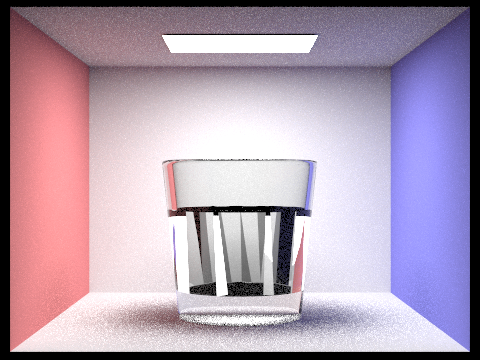
        
1. Poorly rendered cup

    

    

        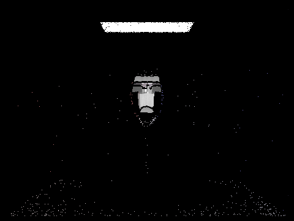
        
2. Wine glass without correct surface normals

    

## Results
<!-- Your final images, animations, video of your system (whichever is relevant). You can include results that you think show off what you built but that you did not have time to go over on presentation day. -->

Here are some of our relevant results from our checkpoint work, as well as our addtional work creating the microfacet BSDF and submerging the bunny in a liquid with a flat top surface (rectangular prism with a water refractive BSDF). 

    

        
        
 Water bunny (IOR=1.33)

    

    

        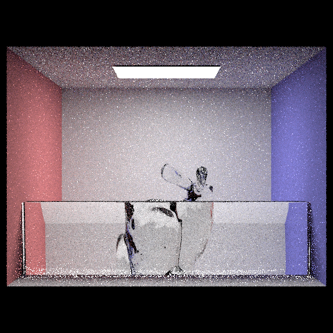
        
 Glass bunny behind glass wall

    

    

        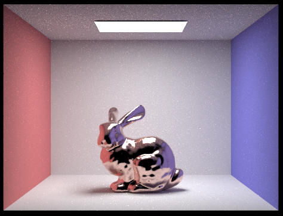
        
 Bunny with copper microfacet BSDF 

    

    

        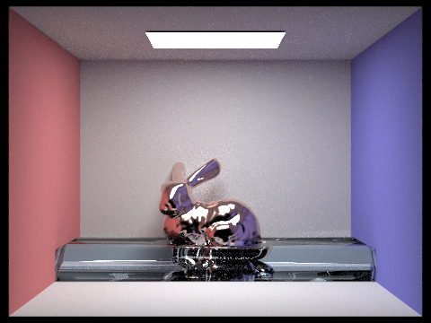
        
 Copper bunny in water 

    

Here are the models we created in Blender! Our two main models werre creating a cup with water and a wine glass with water. However, each of our "custom" images from above required the use of Blender in order to generate the correct .dae file. For example, the water was modeled as a rectangular prism in Blender with the bunny extruded, so we would need to add any new features in Blender and make further minor edits (changing positioning, colors, etc.) directly in the .dae file.

    

        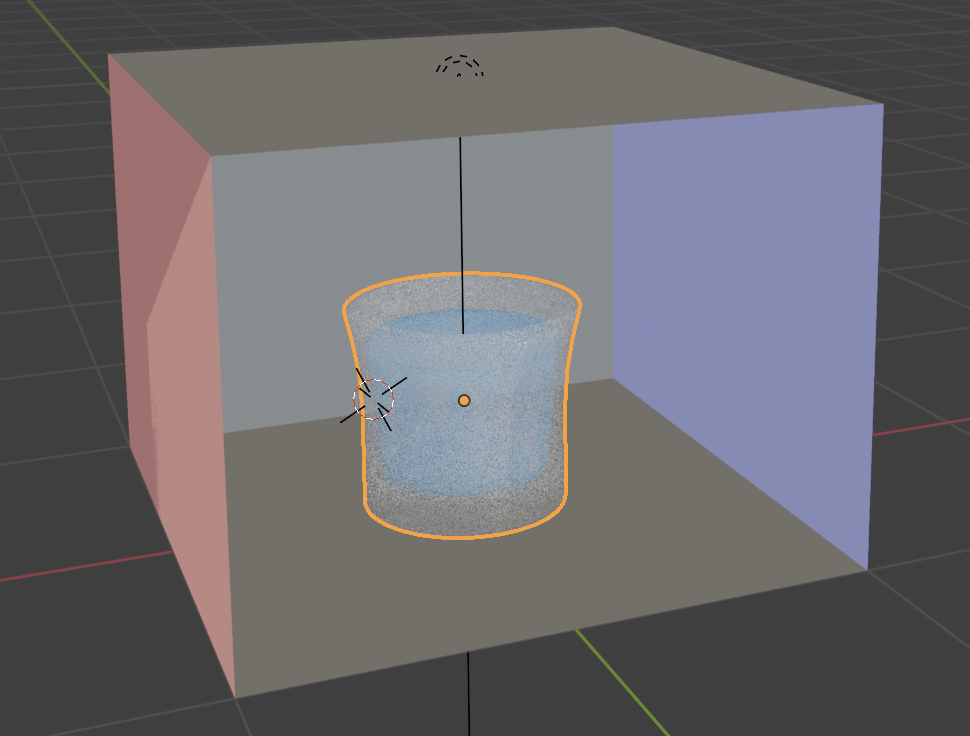
        
 Glass cup 

    

    
    

        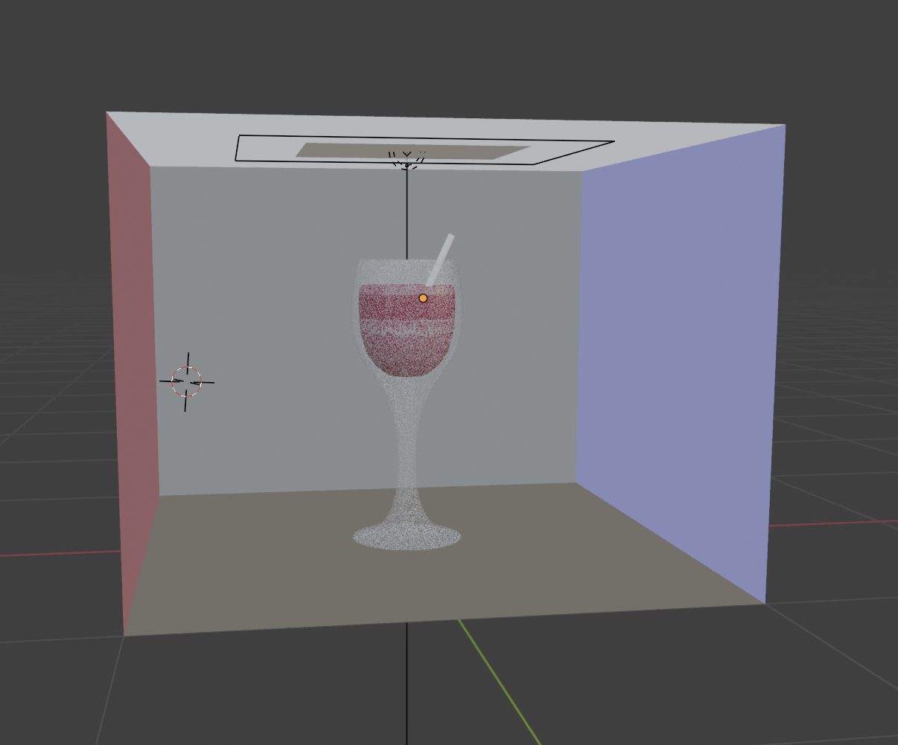
        
 Wine glass 

    

Here are the Blender models rendered with our pathtracer.

[christine: wrote this sentence but put it where appropriate] We changed the surface of the water in the bunny image to be wavy to simulate a real-world water surface. 

    

        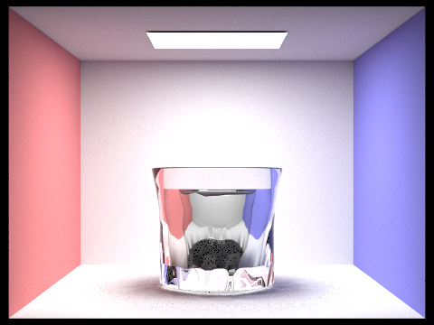
        
 Glass cup filled with water 

    

    

        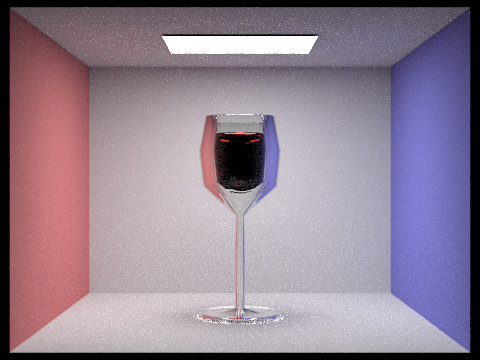
        
 Wine glass filled with wine 

    

    

        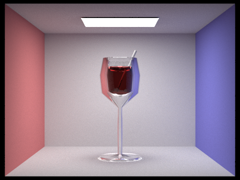
        
 Wine glass filled with wine and a refracted straw 

    

    

        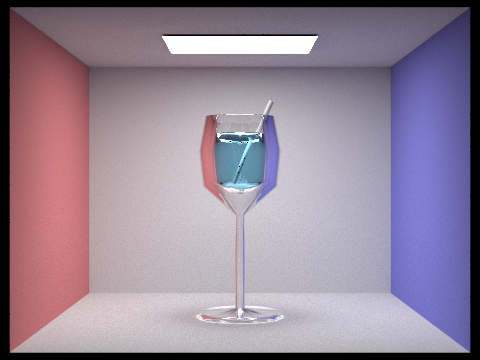
        
 Wine glass filled with water and a refracted straw 

    

    

        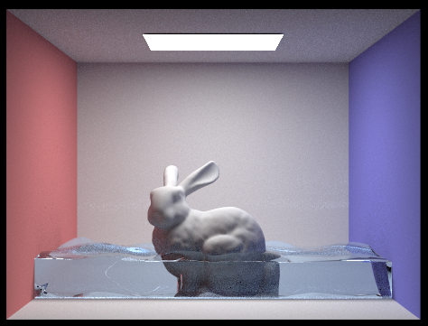
        
 Bunny in water with waves 

    

    

        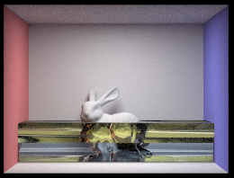
        
 Bunny in oil and water layers, separated by air 

    

    

        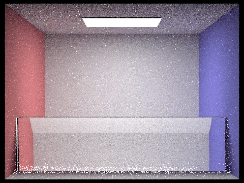
        
 Bunny behind glass 

    

<!-- Please include in your final deliverable a small clip, gif, movie, or animation of your team’s output for the final showcase. -->

## References

To create the refraction, glass, and microfacet BSDFs, we heavily relied on the Project 3-2 spec from Spring 2023: <a href="https://cs184.eecs.berkeley.edu/sp23/docs/proj3-2">https://cs184.eecs.berkeley.edu/sp23/docs/proj3-2</a>.

We used this side, linked in the spec above, for derivations of the microfacet pdfs for importance sampling: <a href="https://agraphicsguynotes.com/posts/sample_microfacet_brdf">https://agraphicsguynotes.com/posts/sample_microfacet_brdf</a>.

We used the following Blender tutorials to build our models:
- [Wine glass](https://www.youtube.com/watch?v=3uRq9-ynU6E)
- [Cup](https://www.youtube.com/watch?v=5YFEiCKbzAc)

## Contributions

All members contributed to the project significantly.

- Christine:
- Clara: Blender wine glass, straw, and water cup models. Dae file scene preparation; material modelling.
- Kerrine:
- Ramya: